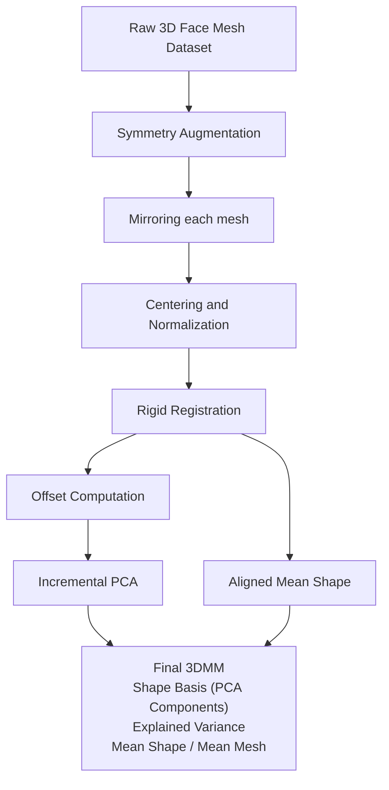

# 3DMM-Pipeline
End-to-end pipeline for building a 3D Morphable Model (3DMM) from raw 3D face meshes — including data preprocessing, symmetry augmentation, centering, rigid alignment, PCA model construction, reconstruction, and random face generation.

This repository provides a complete pipeline for constructing a **3D Morphable Model (3DMM)** from raw 3D face meshes. It covers every step of the classical 3DMM workflow — from dataset preparation and geometric alignment to PCA-based statistical modeling, reconstruction, and random face synthesis.  

It is designed to be **modular, reproducible, and research-ready**, making it useful for academic research, graphics pipelines, or as a foundation for downstream tasks such as 3DMM fitting, facial animation, and identity modeling.

---

## Architecture



---

## Features

- **Data Preprocessing**
  - Automatic mirroring with symmetry index
  - Centering and normalization
  - Rigid alignment (Procrustes with optional scale)

- **3DMM Construction**
  - Offset computation relative to mean shape
  - Incremental PCA for large datasets
  - Explained variance and reconstruction error analysis

- **Model Usage**
  - Progressive reconstruction visualization
  - Random face generation from PCA parameter distribution
  - Reconstruction of unseen identities

- **Evaluation Tools**
  - RMSE reconstruction error plotting
  - PCA component analysis and visualization

---

### Required packages

- torch
- numpy
- scikit-learn
- matplotlib
- igl (Python bindings for libigl)
- torch.utils.data

### Installation

```bash
git clone https://github.com/<your-username>/3DMM-Construction-Pipeline.git
cd 3DMM-Construction-Pipeline
python -m venv .venv && source .venv/bin/activate
pip install -r requirements.txt


